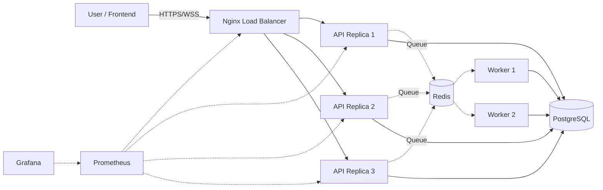

# Deployment Guide: Setup VPS & Deploy Backend dari Nol (0)

This document guides you through installing, configuring, and deploying the system to a high-scale Production environment from scratch.

## 1. Infrastructure Architecture



---

## 2. Prasyarat (*Prerequisites*)

- **VPS / Cloud Instance**: Ubuntu 22.04 LTS (Direkomendasikan minimal 4 Core CPU, 8GB RAM).
- **Domain**: Sebuah domain aktif (misal: `api.toko-anda.com`) yang sudah diarahkan (A Record DNS) ke Alamat IP VPS Anda.
- **Akses**: *Root access* atau *user* dengan hak `sudo` melalui SSH.
- **GitHub PAT**: *Personal Access Token* (Classic) dari GitHub dengan izin `read:packages`.

---

## 3. Tahap 1: Persiapan Server Dasar

1. **Masuk ke VPS via SSH**
   ```bash
   ssh root@<IP_VPS_ANDA>
   ```

2. **Perbarui Paket Sistem**
   Penting untuk memastikan sistem operasi menggunakan versi paket keamanan terbaru.
   ```bash
   apt update && apt upgrade -y
   ```

3. **Instal Perangkat Lunak Penting**
   ```bash
   apt install -y curl wget git nano ufw
   ```

4. **Konfigurasi Firewall (UFW)**
   Buka port yang diperlukan (SSH, HTTP, HTTPS).
   ```bash
   ufw allow OpenSSH
   ufw allow 80/tcp
   ufw allow 443/tcp
   ufw enable
   ```

---

## 4. Tahap 2: Instalasi Docker & Docker Compose

Sistem kita mengandalkan kontainerisasi penuh. Instal Docker Engine resmi.

1. **Unduh dan jalankan skrip instalasi resmi Docker:**
   ```bash
   curl -fsSL https://get.docker.com -o get-docker.sh
   sudo sh get-docker.sh
   ```

2. **Verifikasi Instalasi:**
   ```bash
   docker --version
   docker compose version
   ```

---

## 5. Tahap 3: Autentikasi ke GitHub Container Registry (GHCR)

Karena *image* Docker sistem ini tersimpan secara privat di GitHub, server perlu diberi akses untuk menarik (*pull*) *image* tersebut.

1. **Login ke GHCR**
   Gunakan GitHub Username Anda dan *Personal Access Token* (PAT) sebagai *password*.
   ```bash
   docker login ghcr.io -u "USERNAME_GITHUB_ANDA"
   # (Paste GitHub PAT Anda saat diminta password)
   ```
   > [!IMPORTANT]  
   > Pastikan muncul pesan `Login Succeeded`. Kredensial ini akan disimpan secara otomatis di `~/.docker/config.json` yang mana nanti akan dibaca oleh Watchtower untuk *auto-update*.

---

## 6. Tahap 4: Menyiapkan Repositori & Environment

1. **Kloning Repositori**
   Meskipun *image* diunduh dari GHCR, kita tetap membutuhkan file `docker-compose.yml`, `nginx.conf`, dan `.env` dari kode sumber.
   ```bash
   git clone https://github.com/USERNAME_GITHUB_ANDA/bakcend-template-cs-ai-bot.git
   cd bakcend-template-cs-ai-bot
   ```

2. **Konfigurasi Environment Variables**
   Salin *template* rahasia dan isi nilainya.
   ```bash
   cp .env.example .env
   nano .env
   ```
   
   **Pastikan variabel kunci berikut benar (JANGAN gunakan localhost):**
   ```env
   # Database & Redis menggunakan nama internal Docker
   DATABASE_URL=postgresql+asyncpg://postgres:password_kuat@db:5432/customer_service_ai
   REDIS_URL=redis://redis:6379/0

   # Rahasia Keamanan (Ganti dengan string acak panjang)
   SECRET_KEY="super_secret_string_untuk_jwt"
   ENCRYPTION_KEY="32_byte_string_base64_sama_seperti_di_local"
   ```

---

## 7. Tahap 5: Menjalankan Sistem & Auto-Deploy (Watchtower)

Kita akan menggunakan fitur `--scale` dari Docker Compose untuk menjalankan arsitektur klaster (3 replika API dan 3 Pekerja Latar Belakang).

1. **Jalankan Klaster**
   Perintah ini akan secara otomatis menarik *image* dari GHCR, membuat jaringan internal, dan menyalakan *database* beserta Redis.
   ```bash
   docker compose up -d --scale api=3 --scale worker=3
   ```

2. **Cek Status Kontainer**
   Pastikan semuanya berstatus `Up` (dan `Healthy` untuk Postgres/Redis).
   ```bash
   docker compose ps
   ```

3. **Migrasi Database (Pertama Kali Saja)**
   Karena database masih kosong, jalankan skrip `alembic` melalui salah satu kontainer API untuk membentuk struktur tabel.
   ```bash
   docker compose exec -it api-1 alembic upgrade head
   ```

---

## 8. Tahap 6: Konfigurasi Domain & SSL (HTTPS)

API tidak boleh berjalan di *Production* tanpa enkripsi. Kita akan mengamankan Nginx menggunakan Let's Encrypt.

1. **Instal Certbot (Let's Encrypt)**
   ```bash
   apt install -y certbot python3-certbot-nginx
   ```

2. **Konfigurasi Nginx**
   Buka file konfigurasi Nginx (berada di dalam folder `nginx/nginx.conf` pada repositori Anda). Pastikan konfigurasi merujuk ke domain Anda.
   ```bash
   nano nginx/nginx.conf
   # Pastikan blok server memiliki: server_name api.toko-anda.com;
   ```

3. **Hasilkan Sertifikat SSL**
   Karena Nginx kita berjalan di dalam kontainer Docker, metode paling mudah adalah menggunakan `certbot standalone` atau memasang SSL di depan *Reverse Proxy* di level *host* Ubuntu. Namun, untuk kemudahan, jika Nginx langsung menghadap publik (port 80):
   ```bash
   # Matikan sementara Nginx docker agar Certbot bisa memakai port 80
   docker compose stop nginx
   certbot certonly --standalone -d api.toko-anda.com
   ```

4. **Tautkan Sertifikat ke Nginx Docker**
   Modifikasi `docker-compose.yml` agar *volume* sertifikat Certbot terbaca oleh Nginx:
   ```yaml
   nginx:
     volumes:
       - ./nginx/nginx.conf:/etc/nginx/nginx.conf:ro
       - /etc/letsencrypt:/etc/letsencrypt:ro
   ```
   Nyalakan kembali Nginx:
   ```bash
   docker compose up -d nginx
   ```

---

## Selesai! 🎉

Backend Anda kini telah beroperasi di awan secara penuh. 
- **Auto-Deployment Aktif**: Setiap kali Anda melakukan `git push` ke *branch* `main`, GitHub Actions akan membuat *image* baru, dan kontainer `watchtower` di VPS Anda akan otomatis menarik pembaruan tersebut tanpa sistem mati (*zero-downtime*).
- **Monitoring Aktif**: Jika terjadi *error* pada sistem, notifikasi peringatan akan otomatis masuk ke bot Telegram *DevOps* Anda.
- **API Aktif**: Anda bisa langsung mengakses `https://api.toko-anda.com/docs` untuk mulai mengintegrasikan *Frontend*!
