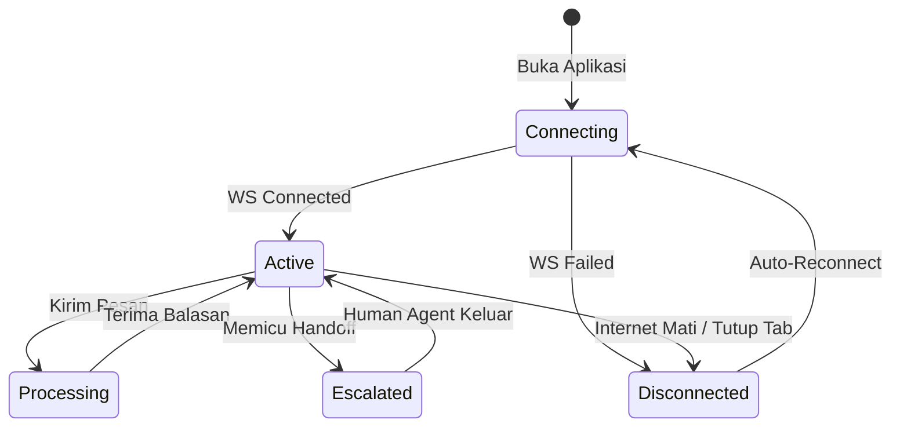

# State Machine (Frontend)

Walaupun LangGraph di sisi server memiliki *state machine* yang rumit, pengembang *Frontend* hanya perlu mengatur sekumpulan *State* (Status) visual yang sederhana untuk di-render di antarmuka pelanggan.

## Siklus Hidup Obrolan (Chat Lifecycle)

## Daftar State UI

1. **`Connecting`** (Menghubungkan)
   - **Pemicu:** Klien menginisiasi koneksi `WebSocket`.
   - **Aksi UI:** Tampilkan ikon *Loading* berputar. Sembunyikan tombol kirim.
   
2. **`Active`** (Aktif / Obrolan Terbuka)
   - **Pemicu:** Acara `onopen` dari WebSocket dipanggil.
   - **Aksi UI:** Munculkan kotak masukan teks (*input textbox*).

3. **`Processing`** (AI Sedang Berpikir)
   - **Pemicu:** Klien mengirim pesan (tombol kirim ditekan) **ATAU** menerima pesan JSON dengan `"type": "typing"`.
   - **Aksi UI:** Tampilkan animasi titik tiga melompat (*bouncing dots*). Kunci sementara (*disable*) kotak masukan teks.

4. **`Escalated`** (Dalam Eskalasi)
   - **Pemicu:** Menerima JSON `"type": "escalation"`.
   - **Aksi UI:** Ganti profil avatar AI (bot) menjadi avatar Agen Manusia. Tambahkan peringatan kuning/merah *"Anda terhubung dengan cs manusia."*

5. **`Disconnected`** (Koneksi Putus)
   - **Pemicu:** Acara `onclose` atau `onerror` dari WebSocket terpanggil.
   - **Aksi UI:** Tampilkan spanduk (*banner*) merah di atas obrolan: *"Koneksi terputus. Mencoba menghubungkan kembali..."*. Kunci tombol kirim teks.
